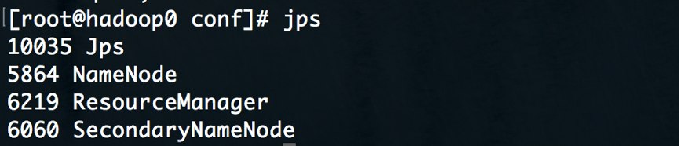
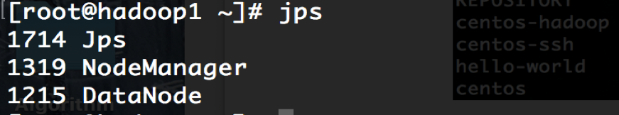
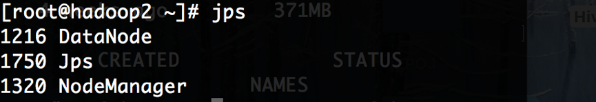
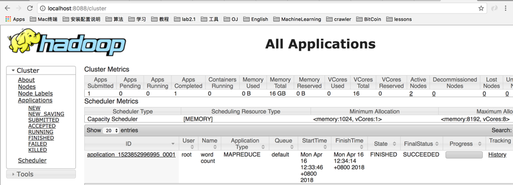
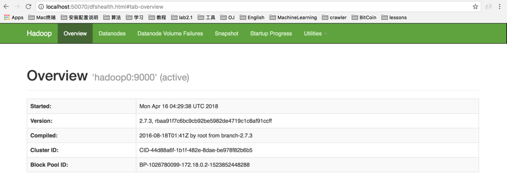
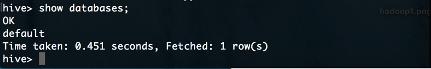

## Hive分布式数据库
### 体系结构  
Hive分布式体系结构主要包括三部分：分布式Hadoop，元数据库Mysql，Hive数据仓库。具体如下：  
  
1. 在主节点`hadoop0`上安装配置Hive，完成后便具备了客户端访问的命令接口。因此可以在主节点上直接通过`hive`命令进入Hive数据库。
  
2. 元数据存储在Mysql数据库中。元数据包括表的名字，表的列和分区及其属性，表的属性（是否为外部表等），表的数据所在目录等。  

3. 数据存储在HDFS中，大部分的查询由MapReduce完成。

### 物理设计  
搭建Hadoop分布式集群环境通常有以下两个办法：  
  
1. 多台机器部署   
 
2. 主机上开多个虚拟机  
  
考虑到手头没有多台机器以及主机上开多个虚拟机开销较大，因此决定另辟蹊径。Docker可以很方便地搭建多个容器并且容器启动速度很快，实验时使用Docker来搭建集群环境，具体实现步骤如下：   
 
1. 使用Docker构建一个hadoop运行环境镜像  
  
2. 使用上述镜像构建三个节点： `hadoop0`， `hadoop1`， `hadoop2`, 并将`hadoop0`作为主节点    

3. 在`hadoop0`上配置hadoop以及hive信息 
  
4. 在主节点`hadoop0`上启动hive  

### 实验场景  
构建Hadoop分布式集群环境，然后采用TPC-H基准测试分布式Hive的性能和单机版mysql的性能并进行比较。  

### 集群搭建  
#### 应用准备  
主机系统为：MacOS 10.12，构建前，准备好以下工具：  
  
1. [Docker-18.03.0-ce](https://www.docker.com/)    
2. [JDK-1.8](http://www.oracle.com/technetwork/java/javase/downloads/jdk8-downloads-2133151.html)  
3. [Hadoop-2.7.3](https://archive.apache.org/dist/hadoop/core/hadoop-2.7.3/)  
4. [Hive-2.1.1](https://archive.apache.org/dist/hadoop/core/hadoop-2.1.1-beta/) 
5. [Connector/J 5.1.46](https://dev.mysql.com/downloads/connector/j/) 

#### 构建镜像  
使用Docker启动三台`Centos`虚拟机，三台机器上安装Hadoop和Java。具体步骤如下：  
  
1. Mac上安装Docker，然后使用Docker账号登录 
		
		docker login 
2. 使用Docker拉取`Centos`镜像  
  
   		docker pull centos  
   		
3. 构建具有ssh功能的`centos-ssh`镜像,其中[Dockerfile](Images/centos-ssh/Dockerfile)如下：  
	  
	  
		FROM centos
		MAINTAINER 'your docker username'
		RUN yum install -y openssh-server sudo
		RUN sed -i 's/UsePAM yes/UsePAM no/g' /etc/ssh/sshd_config
		RUN yum  install -y openssh-clients
		RUN echo "root:root" | chpasswd
		RUN echo "root   ALL=(ALL)       ALL" >> /etc/sudoers
		RUN ssh-keygen -t dsa -f /etc/ssh/ssh_host_dsa_key
		RUN ssh-keygen -t rsa -f /etc/ssh/ssh_host_rsa_key
		RUN mkdir /var/run/sshd
		EXPOSE 22
		CMD ["/usr/sbin/sshd", "-D"]  
	docker构建镜像命令如下：  
	
		cd centos-ssh
		docker build -t "centos-ssh" .  
4. 基于上一步的`centos-ssh`镜像，构建具有jdk和hadoop的`centos-hadoop`镜像，[Dockerfile](Images/centos-hadoop/Dockerfile)如下：  

		FROM centos-ssh
		ADD jdk-8u161-linux-x64.tar.gz /usr/local/
		RUN mv /usr/local/jdk1.8.0_161 /usr/local/jdk1.8
		ENV JAVA_HOME /usr/local/jdk1.8
		ENV PATH $JAVA_HOME/bin:$PATH
		ADD hadoop-2.7.3.tar.gz /usr/local
		RUN mv /usr/local/hadoop-2.7.3 /usr/local/hadoop
		ENV HADOOP_HOME /usr/local/hadoop
		ENV PATH $HADOOP_HOME/bin:$PATH   
	docker构建镜像的命令如下：  
		
		cd centos-hadoop
		dcoker build -t "centos-hadoop" .
		
	注：hadoop压缩包和jdk压缩包需要放在`centos-hadoop`目录下。  
	  
#### 创建Hadoop集群  
实验中hadoop集群由三个节点构成，即一个主节点`hadoop0`和两个字节点`hadoop1`、`hadoop2`,具体步骤如下：  

1. 创建自定义网络   
	由于Docker每次重启时都会给节点重新分配IP，因此一个好的办法是给节点分配固定的IP地址。  
	
		docker network create --subnet=172.18.0.0/16 mynetwork  
2.  创建三个docker容器  

		docker run --name hadoop0 --hostname hadoop0 --net mynetwork --ip 172.18.0.2 -d -P -p 50070:50070 -p 8088:8088  centos-hadoop  
		docker run --name hadoop1 --hostname hadoop1 --net mynetwork --ip 172.18.0.3 -d -P centos-hadoop  
		docker run --name hadoop2 --hostname hadoop2 --net mynetwork --ip 172.18.0.4 -d -P centos-hadoop  
		
	这样三台机器都有了固定的IP，可以试着在节点`hadoop0`上`ping`一下，看是否成功：  
	
		ping 172.18.0.3
		ping 172.18.0.4
 
#### 配置Hadoop集群  
Hadoop集群配置如下：  

1. 设置主机名和容器的映射，在三个容器上修改 `/etc/hosts` 文件，添加如下配置：
  
  		172.18.0.2    hadoop0
		172.18.0.3    hadoop1
		172.18.0.4    hadoop2
		
2. 设置ssh免密登录，具体操作如下：  

		##hadoop0
		cd  ~
		mkdir .ssh
		cd .ssh
		ssh-keygen -t rsa
		ssh-copy-id -i localhost
		ssh-copy-id -i hadoop0
		ssh-copy-id -i hadoop1
		ssh-copy-id -i hadoop2
		##hadoop1
		cd  ~
		cd .ssh
		ssh-keygen -t rsa
		ssh-copy-id -i localhost
		ssh-copy-id -i hadoop1
		##hadoop2
		cd  ~
		cd .ssh
		ssh-keygen -t rsa
		ssh-copy-id -i localhost
		ssh-copy-id -i hadoop2  
	
3. 在主节点`hadoop0`上修改hadoop配置文件，进入到`/usr/local/hadoop/etc/hadoop`目录,修改目录下的配置文件`hadoop-env.sh`、`core-site.xml`、`hdfs-site.xml`、`yarn-site.xml`、`mapred-site.xml`（[具体配置参考](https://bigdatalatte.wordpress.com/2017/02/01/install-hadoop-yarn-hive-on-a-macbook-pro-el-capitan/),也可以查看[我的配置文件 ](Conf/hadoop)  
   这里注意原始目录中没有`mapred-site.xml`文件，因此需要将执行以下命令创建该文件:  
      
   		cd /usr/local/hadoop/etc/hadoop  
   		mv mapred-site.xml.template mapred-site.xml  
   	
4. 格式化  
	
		 cd /usr/local/hadoop
		 bin/hdfs namenode -format   
5. 首先启动伪分布式hadoop,
	
		cd /usr/local/hadoop
		sbin/start-all.sh  
	接着查看`hadoop0`上相应进程是否被启动，使用`jps`命令，应该在看到以下进程：  
	
		SecondaryNameNode
		NameNode
		Jps
		ResourceManager
		DataNode
		NodeManager
	如果一切正常，便先停职伪分布式hadoop  
	
		sbin/stopa-all.sh

6. 修改`hadoop0`中hadoop的一个配置文件`etc/hadoop/slaves` 
删除原来的所有内容，修改为如下:  

		hadoop1
		hadoop2
	然后在`/usr/local/hadoop/etc/hadoop/yarn-site.xml`文件中，增加以下配置：  
	
		<property>
    		<description>The hostname of the RM.</description>
    		<name>yarn.resourcemanager.hostname</name>
    		<value>hadoop0</name>
    	</property>
    
7. 在主节点`hadoop0` 上执行以下命令：  

		scp  -rq /usr/local/hadoop   hadoop1:/usr/local
		scp  -rq /usr/local/hadoop   hadoop2:/usr/local
		
7. 接下来便可以启动hadoop分布式集群服务了

		cd /usr/local/hadoop
		sbin/start-all.sh  
		
基于以上几步我们可以使用`jps`命令查看节点上的进程，以验证hadoop集群是否正常。  
`hadoop0`上的进程: 
   

`hadoop1`上的进程:
  
 
`hadoop2`上的进程:
 

由于节点`hadoop0`上运行的web服务，监听`8088`端口和`50070`端口，可以在主机上查看hadoop集群，如下：  
  
  

#### Hive安装配置  
1. 首先将主机上的hive压缩包复制到`hadoop0`，并解压至`/usr/local/hive`,然后在`/etc/profile`上添加环境变量,具体命令如下：  
		
		cd Resources
		docker cp apache-hive-2.1.1-bin.tar.gz hadoop0:/usr/local
		tar -zxvf apache-hive-2.1.1-bin.tar.gz /usr/local/hive
		
		cd /etc
		vi profile
			#in profile
			export HIVE_HOME=/usr/local/hive
			export PATH=$HIVE_HOME/bin:$PATH 
		source /etc/profile
这样便可以方便地执行`hive`机器相关命令了。

2. 由于元数据存储在Mysql中，因此需要启动一个docker容器并创建`metastore`数据库。  
	
		docker pull image
		docker run --name mysql -e MYSQL_ROOT_PASSWORD=111111 --net mynetwork --ip 172.18.0.5  -d
		docker exec -it mysql bash
		mysql -u root -p
		
		#in mysql 
		create database metastore;
	
3. 需要将Hive和Mysql数据库连接起来，这里用到`jdbc connector`,将connector中的`mysql-connector-java-5.1.41-bin.jar`文件拷贝到`hadoop0`的`$HIVE_HOME/lib`中。

4. 在hdfs中创建下面的目录，并且授权

		hdfs dfs -mkdir -p /user/hive/warehouse
		hdfs dfs -mkdir -p /user/hive/tmp
		hdfs dfs -mkdir -p /user/hive/log
		hdfs dfs -chmod -R 777 /user/hive/warehouse
		hdfs dfs -chmod -R 777 /user/hive/tmp
		hdfs dfs -chmod -R 777 /user/hive/log  
		
5. 修改hive配置文件，进入到`hadoop0`的`/usr/local/hive/conf`目录中，修改其中的`hive-env.sh`,`hive-site.xml`文件。（[修改参考](https://bigdatalatte.wordpress.com/2017/02/01/install-hadoop-yarn-hive-on-a-macbook-pro-el-capitan/))，这里是[我的配置 ](Conf/hive)  
	注：初始目录下是没有这些文件的，因此首先要创建：  
	
		cp hive-env.sh.template hive-env.sh
		cp hive-default.xml.template hive-site.xml
		cp hive-log4j2.properties.template hive-log4j2.properties
		cp hive-exec-log4j2.properties.template hive-exec-log4j2.properties  
		
6. 创建tmp文件  

		mkdir -p /home/hadoop/hive/tmp
	然后在`hive.xml`文件中做以下修改(我的配置中已改好)：
	
		change {system:java.io.tmpdir} to /home/hadoop/hive/tmp
		change {system:user.name} to {user.name}
6. 接着初始化hive，后台启动metastore服务，然后启动hive

		schematool -dbType mysql -initSchema
		hive --service metastore &
		hive

	此时可以成功进入到hive命令客户端：
	
		
### 实际查询 
#### TPC-H数据生成
实验中在主机（MacOS）下利用TPC-H源码生成`1G`的数据(受限于性能)，然后拷贝到主节点`hadoop0`。数据生成步骤如下：  

1. 下载[TPC-H源码](http://www.tpc.org/tpch/default.asp)  
2. 修改`dbgen/makefile`文件,具体如下：

		CC = GCC 
	  	DATABASE = SQLSERVER
	  	MACHINE=LINUX
	  	WORKLOAD = TPCH
3. 修改`dbgen/tpcd.h`文件中的`SQLSERVER`段，具体如下：
 	
 		#define GEN_QUERY_PLAN     "EXPLAIN;"
     	#define START_TRAN         "START TRANSACTION;\n"
    	#define END_TRAN           "COMMIT;\n"
     	#define SET_OUTPUT         ""
     	#define SET_ROWCOUNT       "limit %d;\n"
     	#define SET_DBASE          "use %s;\n"
		
4. make编译，然后生成`1G`的数据  

		./dbgen -s 1
		
程序运行完成后，可以看到`dbgen`目录下新生成了8张表。

#### 建表、导入数据 
首先下载[TPC-H-on-Hive命令包](https://issues.apache.org/jira/browse/HIVE-600)，然后将其解压至`/opt/TPC-H_on_Hive`，目录`tpch`中有22条查询测试语句。

	cd Resources
	docker cp TPC-H_on_Hive.zip hadoop0:/opt
	
	#on hadoop0
	cd /opt
	tar -zxvf TPC-H_on_Hive.zip TPC-H_on_Hive
接着将生成的八张表复制到`/opt/TPC-H_on_Hive/data`目录下，以nation.tbl为例：

	cd Resources/2.17.3/dbgen
	docker cp nation.tbl hadoop0:/opt/TPC-H_on_Hive/data

在`hadoop0`上编写脚本进行测试：  
	
	#!/bin/bash
	for var in `ls /opt/TPC-H_on_Hive/tpch`
	do 
		echo hive -f /opt/TPC-H_on_Hive/tpch/${var}
		echo
		hive -f /opt/TPC-H_on_Hive/tpch/${var}
		echo
		echo
	done
第一次执行完成后，Hive数据库中增添了许多表，主要是基本的数据表以及查询时建的新表。 接着导入数据：  

	LOAD DATA LOCAL INPATH "/opt/TPC-H_on_Hive/data/nation.tbl" INTO TABLE NATION;
	LOAD DATA LOCAL INPATH "/opt/TPC-H_on_Hive/data/region.tbl" INTO TABLE REGION;
	LOAD DATA LOCAL INPATH "/opt/TPC-H_on_Hive/data/part.tbl" INTO TABLE PART;
	LOAD DATA LOCAL INPATH "/opt/TPC-H_on_Hive/data/supplier.tbl" INTO TABLE SUPPLIER;
	LOAD DATA LOCAL INPATH "/opt/TPC-H_on_Hive/data/partsupp.tbl" INTO TABLE PARTSUPP;
	LOAD DATA LOCAL INPATH "/opt/TPC-H_on_Hive/data/customer.tbl" INTO TABLE CUSTOMER;
	LOAD DATA LOCAL INPATH "/opt/TPC-H_on_Hive/data/orders.tbl" INTO TABLE ORDERS;
	LOAD DATA LOCAL INPATH "/opt/TPC-H_on_Hive/data/lineitem.tbl" INTO TABLE LINEITEM;  
	
### 性能测试
docker系统配置：双核，4G内存，64G硬盘。第二次执行查询脚本，此时数据已经导入好，便会执行实际的查询，会话花费一定的时间。
可以在`localhost:50070`上查看hadoop使用情况，可以看到datanode上都有一部分空间被使用，证明系统确实起到了分布式存储与查询的效果。    

###  性能对比  
作为对比，实验中使用单机Mysql建立数据库，执行和上面相同的查询。为保证相同的系统环境，在docker下建立的`mysql`容器上进行试验，具体步骤如下：  
  
1. 建立数据库   
	  	create table tpch;
	  	use tpch;
2. 建表、设置主键及外键   
   这里主要修改	`/dbgen`目录下的`dss.ddl`以及`dss.ri`文件，`dss.ddl`文件完成建表操作，`dss.ri`文件完成主键、外键设置。([我的修改](Conf/mysql))然后在mysql输入以下语句：  
   
   		/. /2.17.3/dbgen/dss.ddl
   		/. /2.17.3/dbgen/dss.ri
   		
3. 导入数据   
	以`nation.tbl`为例，导入数据语句如下：  
	
		LOAD DATA LOCAL INFILE '/2.17.3/dbgen/nation.tbl'   
		INTO TABLE NATION FIELDS TERMINATED BY '|' LINES TERMINATED BY '|\n';
		
4. 查询操作  
   执行和Hive数据库相同的查询操作，修改查询语句符合mysql语法，以第一条为例：  
   
   		SELECT l_returnflag, l_linestatus, SUM(l_quantity) AS sum_qty,   
   		SUM(l_extendedprice) AS sum_base_price,   
   		SUM(l_extendedprice * (1 - l_discount)) AS sum_disc_price,   
   		SUM(l_extendedprice * (1 - l_discount) * (1 + l_tax)) AS sum_charge,   
   		AVG(l_quantity) AS avg_qty, AVG(l_extendedprice) AS avg_price,  
   		AVG(l_discount) AS avg_disc, COUNT(*) AS count_order   
   		FROM LINEITEM   
   		WHERE l_shipdate <= date '1998-12-01' - interval '108' day   
   		GROUP BY l_returnflag, l_linestatus   
   		ORDER BY l_returnflag, l_linestatus;

### 参考文献  
1. [Install Hadoop,Hive on Mac](https://bigdatalatte.wordpress.com/2017/02/01/install-hadoop-yarn-hive-on-a-macbook-pro-el-capitan/)  
2. [使用TPC-H对Hive测试](https://blog.csdn.net/haoxiaoyan/article/details/53033870)  
3. [使用Docker在本地搭建Hadoop分布式集群](http://www.cnblogs.com/felixzh/p/4992178.html)  
4. [Hadoop Hive sql语法详解](https://blog.csdn.net/hguisu/article/details/7256833)
